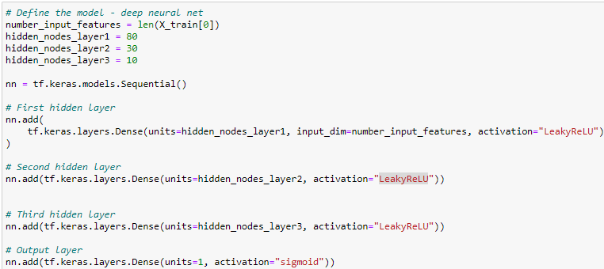
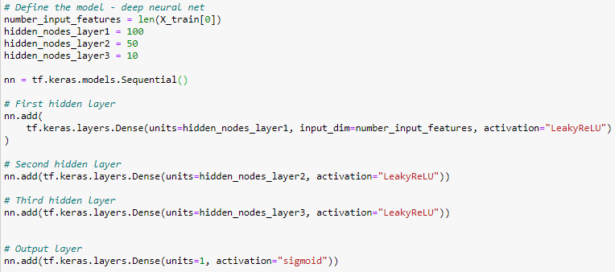

# Neural_Network_Charity_Analysis

## Overview of the analysis

A non-profit philanthropic foundation, Alphabet Soup, dedicated to helping organizations that protect the environment, improve people’s well-being, and unify the world want to analyze the impact of each donation and vet potential recipients. This will help ensure that the foundation’s money is being used effectively. Python TensorFlow will be used to design and train neural network models. A robust deep learning binary classifier capable of interpreting large complex datasets will help Alphabet Soup predict whether applicants will be successful if funded by the organization.

The technical analysis deliverables required to complete the Neural Network Charity analysis include:  

1. Preprocessing Data for a Neural Network Model.
2. Compile, Train, and Evaluate the Optimize the Modelodel.
3. Use Ensemble Classifiers to Predict Credit Risk

## Resources
- Data Source: This analysis was performed using the ***charity_data.csv*** dataset.  
- Software: Python 3.7, Visual Studio Code 1.50.0, Anaconda 4.8.5, Jupyter Notebook 6.1.4 and Pandas

## Results: 

### a.) Data Preprocessing 
- The variable considered target for the model is **"IS_SUCCESSFUL".**
-  The variable(s) considered to be the features for the model are **"EIN", "NAME", "APPLICATION_TYPE", "AFFILIATION", "CLASSIFICATION", "USE_CASE", "ORGANIZATION", "STATUS", "INCOME_AMT" "SPECIAL_CONSIDERATIONS", "SPECIAL_CONSIDERATIONS".**
- The variable(s) that are neither targets nor features, and should be removed from the input data include **"EIN"** and **"NAME".**

### b.) Compiling, Training, and Evaluating the Model

- The number of neurons, layers, and activation functions selected for the neural network model:
    - Neurons: hidden nodes layer 1 = 80; hidden nodes layer 2 = 30.
    - Layers: 2.
    - Activation functions used: ReLu and Sigmoid:
      - The ReLU function is ideal for looking at positive nonlinear input data for classification or regression while the Sigmoid function is used in the outer layer because it is ideal for binary classification.

   - Target model performance achieved:
        - The model accuracy of **72.50%** was below the target model performance of **75%**.

**Steps taken to try and increase model performance include:**

##### Optimization 1:

- Removed extreme value for variable **"ASK_AMT"**.
- Dropped columns **"AFFILIATION" and "ORGANIZATION".**
 - Added additional hidden layers.
 - Change activation function of hidden layers to **"LeakyReLU".**
 - This model performed considerably worse than the previous model (accuracy = **52.53%** ) and was not better than chance in predicting succes rates.

    

##### Optimization 2 and 3:

- Added additional neurons to hidden layers.
- Added additional hidden layers.
- Change activation function of hidden layers to **"LeakyReLU".**
- Increase the epochs to **"150"**.
- This model performace was similar to model 1 (accuracy = **72.44%** )and was still below the target model performance.

    

## Summary:
- The deep learning neural network classifier (model 1) had the highest accuracy score of all models. However, the accuracy score was below the target model performance of **75%**. In general support vector machines (SVMs) and random forest models are able handle tabular data well and should be considered to increase the predictive performance this classifier. Both models are easier to implement and their training times are shorter when compared to deep learning models

